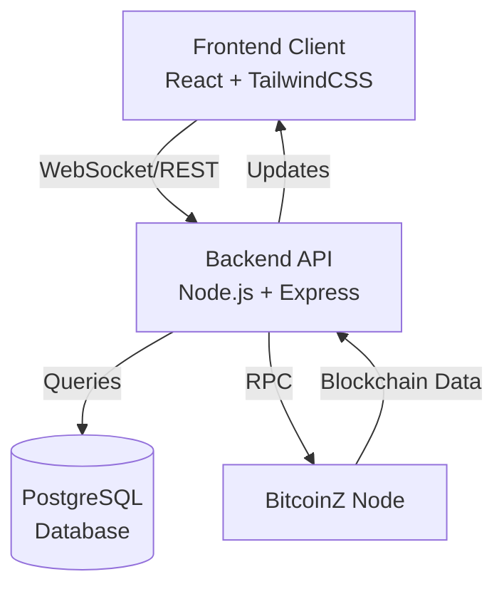

# Modern BitcoinZ Explorer 🚀

A modern, full-featured blockchain explorer for BitcoinZ built with Node.js, React, and PostgreSQL.

[](https://opensource.org/licenses/MIT)
[](https://nodejs.org)
[](https://www.postgresql.org)


## ✨ Features

- **🎨 Modern Design**
  - Clean, responsive user interface built with React and Tailwind CSS
  - Dark mode support
  - Mobile-first responsive design
  - Interactive charts and visualizations

- **📊 Advanced Analytics**
  - Wealth distribution analysis
  - Rich data visualization with interactive charts
  - Top holders tracking
  - Network statistics and metrics
  - Historical data analysis

- **🔄 Real-time Updates**
  - Live block and transaction updates via WebSockets
  - Real-time sync status monitoring
  - Live price and market data
  - Instant search results

- **🔍 Comprehensive Data**
  - Detailed block information
  - Complete transaction history
  - Address tracking and analysis
  - Mining pool statistics
  - Network health metrics

- **🎯 Advanced Features**
  - Multi-criteria search functionality
  - Transaction graphing
  - Address tagging
  - Rich filtering options
  - Export capabilities

## 🏗 Architecture

The explorer is built on a modern three-tier architecture:



### Components

1. **Frontend**
   - React.js application
   - Tailwind CSS for styling
   - Real-time updates via WebSocket
   - Interactive charts using Recharts
   - Responsive design system

2. **Backend**
   - Node.js/Express server
   - RESTful API architecture
   - WebSocket server for live updates
   - RPC connection to BitcoinZ node
   - Background sync processes

3. **Database**
   - PostgreSQL for data storage
   - Optimized indexing
   - Efficient query patterns
   - Data integrity constraints

## 🚀 Quick Start

The easiest way to start the explorer is using the provided start script:

```bash
# Make the script executable
chmod +x start.sh

# Run the explorer
./start.sh
```

This script will:
1. Verify PostgreSQL connection
2. Initialize database schema if needed
3. Launch the backend server
4. Start the frontend development server

## 📦 Manual Installation

### Prerequisites

- Node.js (v16+)
- PostgreSQL (v10+)
- BitcoinZ full node (with RPC enabled)

### Database Setup

```bash
# Create database
createdb bitcoinz_explorer

# Initialize schema
cd backend
node setup-db.js
```

### Backend Setup

```bash
cd backend
npm install
npm start
```

### Frontend Setup

```bash
cd frontend
npm install
npm start
```

## ⚙️ Configuration

### BitcoinZ Node Configuration

Configure your bitcoinz.conf:

```ini
# RPC Configuration
rpcuser=your_rpc_username     # Replace with your secure username
rpcpassword=your_rpc_pass     # Replace with your secure password
rpcport=1978

# RPC Network Settings
rpcbind=127.0.0.1      # Bind RPC to IPv4 localhost only
rpcallowip=127.0.0.1   # Allow RPC connections from IPv4 localhost only
rpcconnect=127.0.0.1   # Specify RPC connection target as IPv4 localhost

# Core Features
experimentalfeatures=1
insightexplorer=1
addressindex=1
spentindex=1
txindex=1
listen=1
server=1
port=1989

# Network Bindings
bind=0.0.0.0:1989      # Bind the main port to all IPv4 interfaces only
# bind=[::]:1989       # IPv6 binding (commented out)

# Network Nodes
addnode=explorer.btcz.app:1989
addnode=explorer.btcz.rocks:1989
addnode=37.187.76.80:1989
addnode=45.32.135.197:1989
```

These settings enable all required features for the explorer including address indexing, transaction indexing, and RPC access. The configuration also includes recommended nodes for better network connectivity.

### Environment Variables

Create a .env file in the backend directory:

```env
# Server Configuration
PORT=3000
NODE_ENV=development

# Database Configuration
DB_TYPE=postgres
DB_HOST=localhost
DB_PORT=5432
DB_NAME=bitcoinz_explorer
DB_USER=postgres
DB_PASSWORD=postgres

# BitcoinZ Node Connection
BITCOINZ_RPC_HOST=127.0.0.1
BITCOINZ_RPC_PORT=1978
BITCOINZ_RPC_USER=your_rpc_username
BITCOINZ_RPC_PASS=your_rpc_password

# Optional Features
ENABLE_WEBSOCKETS=true
ENABLE_RATE_LIMIT=true
CACHE_DURATION=300
```

## 📊 Data Visualization Features

### Wealth Distribution Analytics

- Interactive pie charts showing top holder distribution
- Balance range distribution with bar charts
- Real-time updates of wealth metrics
- Detailed address statistics
- Historical balance tracking

### Network Statistics

- Block time distribution
- Transaction volume analysis
- Mining difficulty trends
- Network hashrate monitoring
- Fee analysis charts

## 🔌 API Documentation

### Core Endpoints

```typescript
// Blocks
GET /api/blocks                    // Get latest blocks
GET /api/blocks/:hash              // Get block by hash
GET /api/blocks/height/:height     // Get block by height

// Transactions
GET /api/transactions              // Get latest transactions
GET /api/transactions/:txid        // Get transaction details

// Addresses
GET /api/addresses/:address        // Get address information
GET /api/addresses/:address/txs    // Get address transactions

// Statistics
GET /api/stats                     // Get network statistics
GET /api/stats/charts              // Get chart data
GET /api/stats/wealth              // Get wealth distribution

// Search
GET /api/search?query=             // Search blocks/txs/addresses
```

### WebSocket Events

```typescript
// Subscribe to updates
socket.emit('subscribe', 'blocks');
socket.emit('subscribe', 'transactions');

// Event listeners
socket.on('newBlock', (block) => {});
socket.on('newTransaction', (tx) => {});
socket.on('syncUpdate', (status) => {});
```

## 🔧 Development Guidelines

### Code Style

- Follow ESLint configuration
- Use Prettier for formatting
- Follow React best practices
- Write meaningful commit messages
- Document complex functions

### Testing

```bash
# Run backend tests
cd backend
npm test

# Run frontend tests
cd frontend
npm test
```

### Building for Production

```bash
# Build frontend
cd frontend
npm run build

# Start production server
cd backend
npm run start:prod
```

## 🤝 Contributing

1. Fork the repository
2. Create your feature branch
3. Commit your changes
4. Push to the branch
5. Create a Pull Request

Please ensure your PR:
- Follows the code style
- Includes tests if applicable
- Updates documentation
- Has a clear description

## 🔍 Troubleshooting

### Common Issues

1. **Connection to BitcoinZ Node Fails**
   - Verify node is running
   - Check RPC credentials
   - Ensure correct port configuration

2. **Database Connection Issues**
   - Verify PostgreSQL is running
   - Check database credentials
   - Ensure database exists

3. **Initial Sync Takes Long**
   - Initial sync reads all blockchain data
   - Progress is shown in the explorer
   - System remains usable during sync

4. **WebSocket Connection Fails**
   - Check if ports are open
   - Verify server is running
   - Check client configuration

## 📄 License

This project is licensed under the MIT License - see the LICENSE file for details.

## 🙏 Acknowledgments

- BitcoinZ Community
- Original bitcore-node-btcz explorer
- Open source contributors

## 🔄 Version History

- 1.0.0: Initial release
  - Modern UI implementation
  - Real-time updates
  - Wealth distribution analytics
  - Advanced charting capabilities

## 📞 Support

- GitHub Issues: [Report a bug](https://github.com/yourusername/modern-explorer/issues)
- Discord: [Join our community](https://discord.gg/bitcoinz)
- Documentation: [Wiki](https://github.com/yourusername/modern-explorer/wiki)
